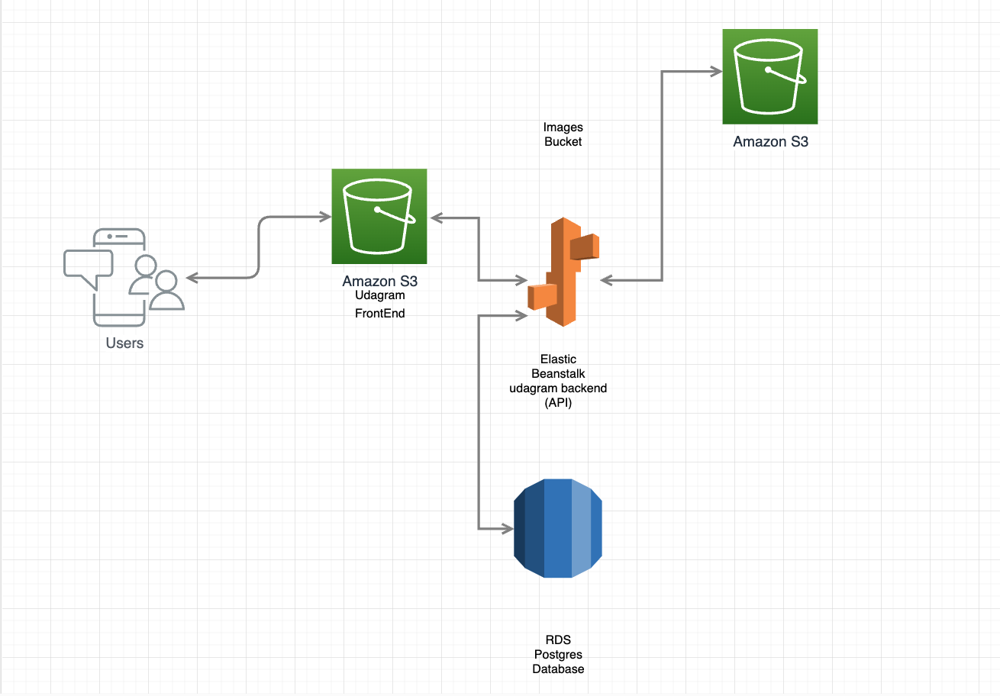

# Hosting a Full-Stack Application

## Infrastructure

- Amazon RDS Managed relational database service

- ElasticBeanstalk for the (backend) API deployment

- S3 for (frontend) web hosting

## Diagram

