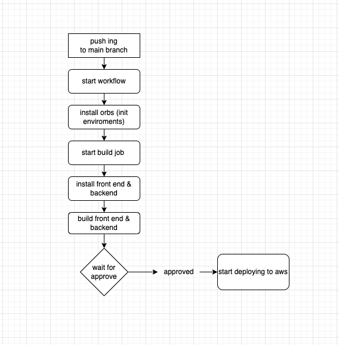

# Hosting a Full-Stack Application

## CircleCi Pipeline

- All Configration are lived on .circleci/config.yml

- first we start by define orgs that contain basc recipes and reproducible actions (install node, aws, eb.)

- than the workflows starts when we push to main branch that will trigger our jobs

- firt job is build that will check out code and Install Front-End Dependencies
and Install Back-End Dependencies than builds Front-End and apis

- after this job success, the pipeline will hold waiting for approvel to start deploy

- after we approve the final job that will deploy will start which will deploy front to aws-s3 and api to aws-eb

## Diagram

